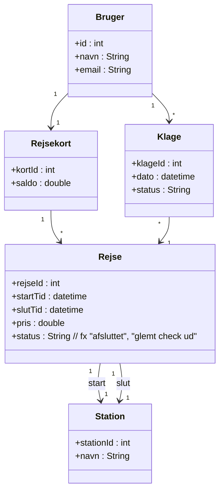
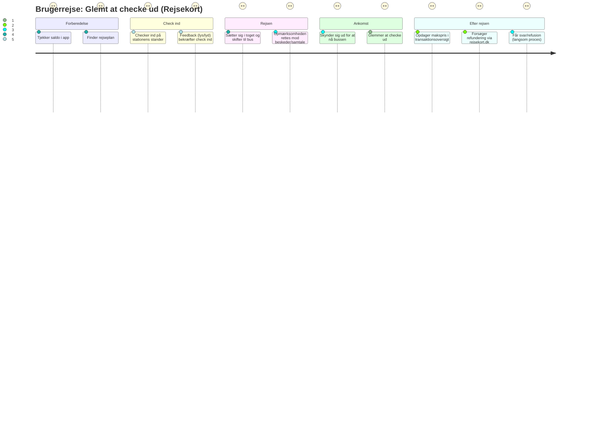
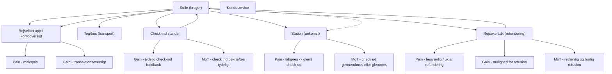

## Beskrivelse af en brugerrejse (eksempel: Glemt at tjekke ud med rejsekort)  

**Persona:** Sofie, 23 år, studerende, rejser ofte med tog og bus.

Brugerrejse:
Forberedelse
- Sofie har penge på sit rejsekort og skal tage toget hjem fra studie.

Check ind
- Hun checker ind på stationen og finder en plads i toget.

Rejsen
- Hun læser på sin telefon og snakker med en ven.

Ankomst
- Da toget når frem, skynder hun sig ud for at nå bussen videre.

Problem – glemt check ud
- Sofie glemmer at checke ud på stationen.
- Næste dag opdager hun, at hun er blevet trukket for en kontrolafgift (maksimumpris).

Efterfølgende handling
- Hun logger på rejsekort.dk for at klage og få refunderet beløbet.
- Hun synes processen er besværlig og langsommelig.

## Ord-/begrebsanalyse af brugerrejsebeskrivelsen

- Aktører/roller: Sofie (bruger), DSB, Rejsekort-system, kundeservice
- Handlinger (verber): checke ind, rejse, læse, snakke, stå af, glemme, opdage, logge på, klage
- Touchpoints: check-ind stander, togstation, rejsekort.dk, kundeservice
- Problemer/pains: glemt check-ud, makspris, besværlig klageproces
- Gains: nem indcheckning, fleksibel rejse, mulighed for refundering
- Moments of truth:  
  - Om Sofie husker at checke ud
  - Om hun kan få en rimelig og hurtig løsning ved fejl

## Forslag til domænemodel (i Mermaid)  

## Journey-diagram (oplevelse pr. fase)

## Flowchart med touchpoints, pains & gains


```mermaid
flowchart TD
  U["Sofie (bruger)"]
  CI["Check-ind stander"]
  TOG["Tog/bus (transport)"]
  ST["Station (ankomst)"]
  APP["Rejsekort app / kontooversigt"]
  WEB["Rejsekort.dk (refundering)"]
  KS["Kundeservice"]

  P1["Pain - tidspres -> glemt check-ud"]
  P2["Pain - makspris"]
  P3["Pain - besværlig / uklar refundering"]

  G1["Gain - tydelig check-ind feedback"]
  G2["Gain - transaktionsoversigt"]
  G3["Gain - mulighed for refusion"]

  M1["MoT - check ind bekræftes tydeligt"]
  M2["MoT - check ud gennemføres eller glemmes"]
  M3["MoT - retfærdig og hurtig refusion"]

  U -->|tjekker saldo| APP
  U -->|ankommer| CI
  CI -->|lys/lyd bekræfter| U
  U -->|rejser| TOG
  U -->|ankommer| ST
  ST -->|mange stimuli / tidspres| U
  U -.->|glemmer check ud (pain)| ST  

  U -->|opdager makspris (pain)| APP
  U -->|anmoder om refundering| WEB
  WEB -->|kræver oplysninger / begrundelse (pain)| U
  WEB -->|status / opdatering| U
  U -->|kontakter ved behov| KS
  KS -->|vejledning / afgørelse| U

  ST --> P1
  APP --> P2
  WEB --> P3

  CI -->|positiv feedback| G1
  APP -->|transparens| G2
  WEB -->|mulighed| G3

  CI --> M1
  ST --> M2
  WEB --> M3

```


