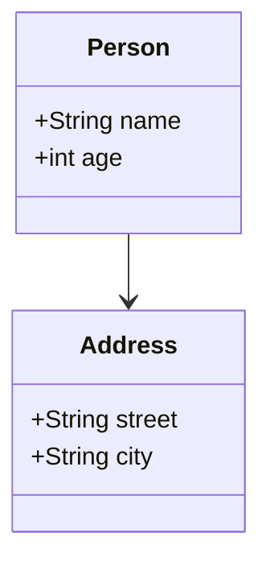
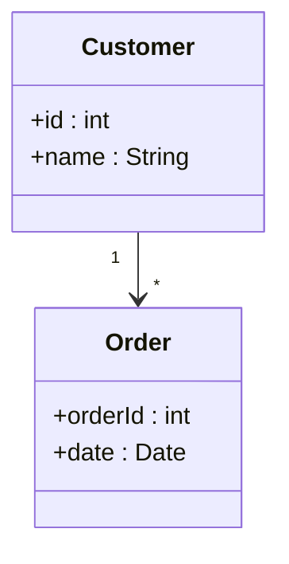
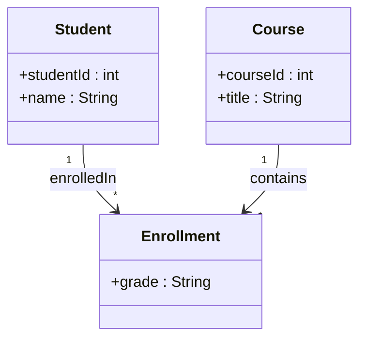

## Basic syntax

```mermaid

classDiagram
    class Person {
        +String name
        +int age
    }

    class Address {
        +String street
        +String city
    }

    Person --> Address

```
## Simple Domain Model Example

```mermaid
classDiagram
    class Customer {
        +id : int
        +name : String
    }

    class Order {
        +orderId : int
        +date : Date
    }

    Customer "1" --> "*" Order
```
## Extended domain model example

```mermaid
classDiagram
    class Student {
        +studentId : int
        +name : String
    }

    class Course {
        +courseId : int
        +title : String
    }

    class Enrollment {
        +grade : String
    }

    Student "1" --> "*" Enrollment : enrolledIn
    Course "1" --> "*" Enrollment : contains

```

