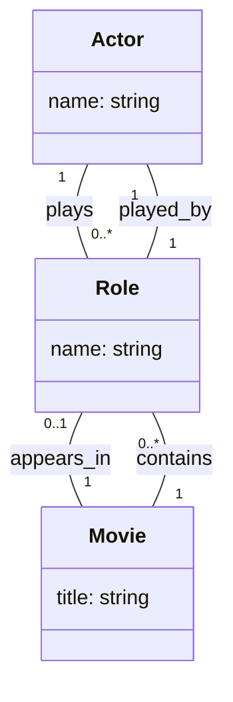
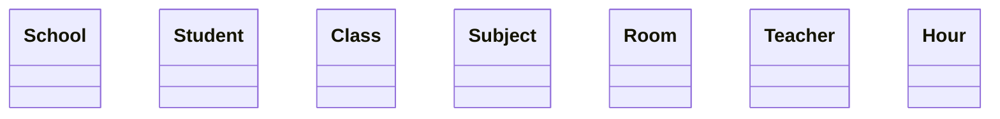
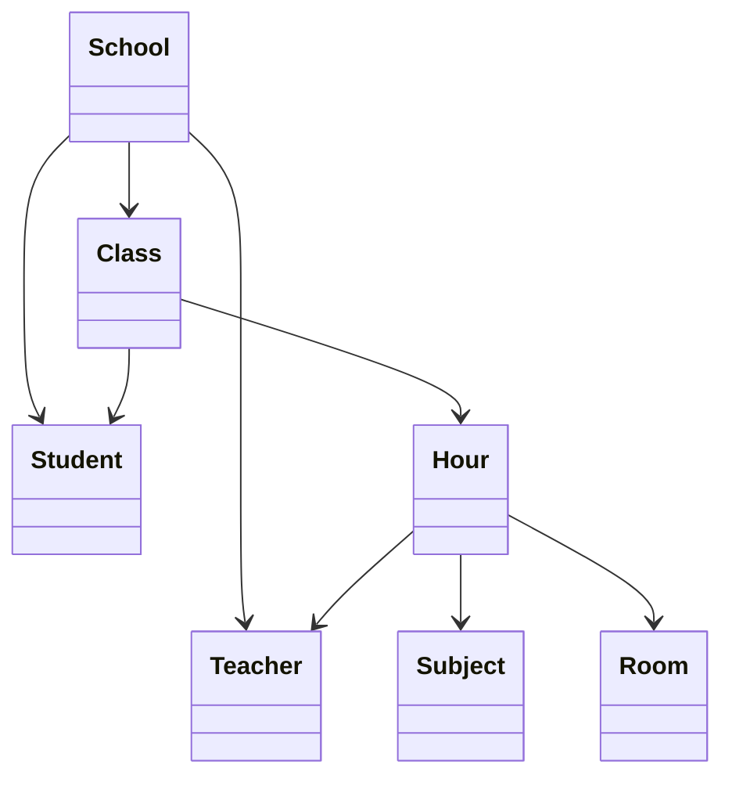
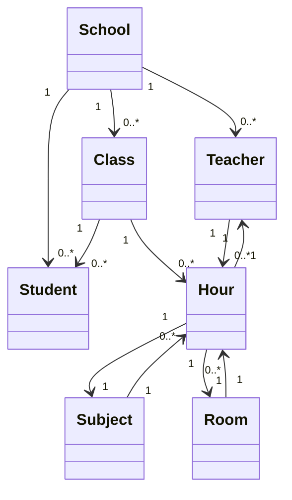
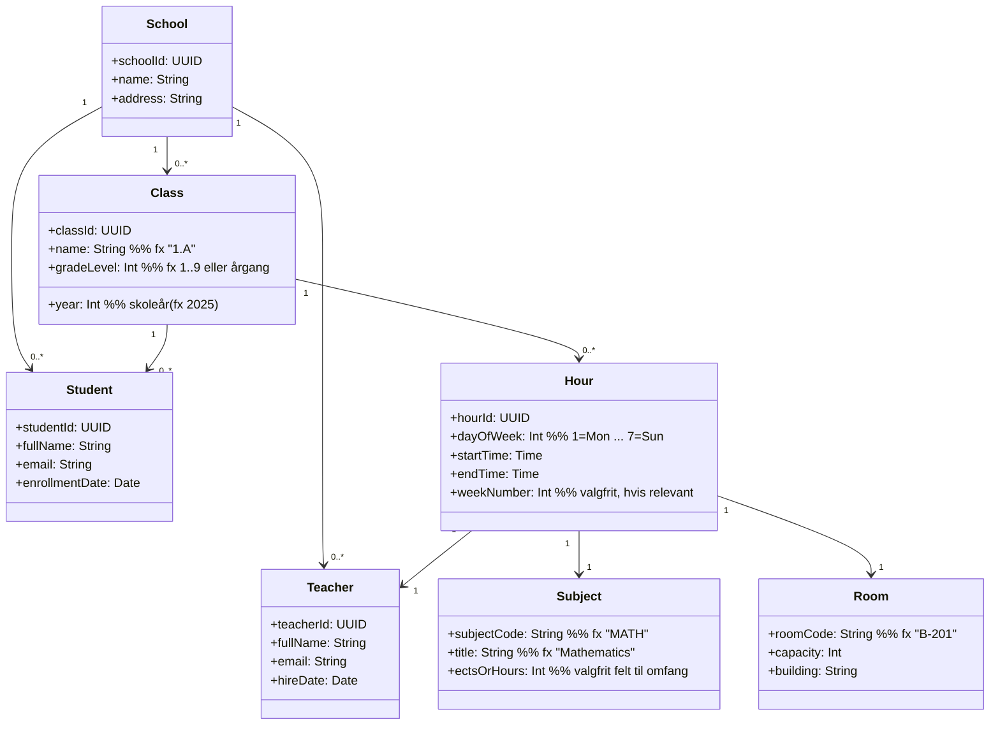

## Eksempel: Associationsklasse (Actor–Movie med Role)


## Trin1:

## Trin2:

## Trin 3:


## Trin 4:

"" Eksemel med identifikaitons af attributer.
```mermaid
classDiagram
    class Book {
      +bookId: UUID
      +isbn: String
      +title: String
    }

    class Author {
      +authorId: UUID
      +fullName: String
    }

    class Member {
      +memberId: UUID
      +fullName: String
      +email: String
      +joinedAt: Date
    }

    class Loan {
      +loanId: UUID
      +borrowedOn: Date
      +dueOn: Date
      +returnedOn: Date?   %% null => active
    }

    %% Relationships
    Member "1" --> "0..*" Loan
    Book "1" --> "0..*" Loan
    Book "0..*" -- "0..*" Author

